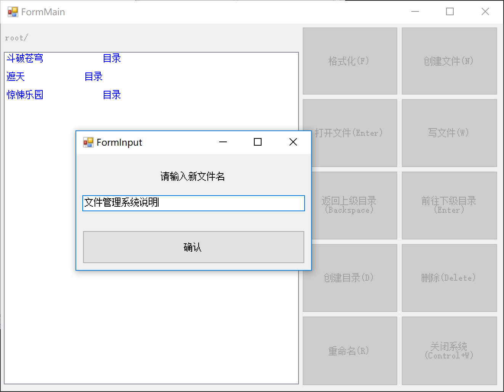

# 文件管理系统实现

操作系统 课程作业3

#### Author：张文喆 1551719

## 项目背景

1. 在内存中开辟一个空间作为文件存储器（虚拟磁盘），在其上实现一个简单的文件管理系统
2. 退出这个文件系统时，应将文件系统的内容保存在磁盘上，下次将其恢复到内存中
3. 文件目录采用多级目录结构

## 开发/运行环境

- 开发环境：Windows10 Pro 1803
- 开发语言：C# 6.0/ .net Framework 4.7.03056
- 开发工具：Microsoft Visual Studio Community 2017

## 数据结构：块组

由于模拟的磁盘较为简单，所以这里采用单块组，取消了逻辑扇区的数据结构。事实上，这一个块组对象就等价于一个虚拟磁盘。我使用了ext2的设计思想，并做了必要的简化，在细节上与真实的ext2文件系统有所不同。

### 1. 卷大小

由于简化了操作，将单个块组等价于磁盘，所以将磁盘的容量记录在块组里面。同时这是一个不太严格的说法，这里的卷大小实际上是所有数据块的尺寸之和。

### 2. 超级块

用于描述文件系统的整体信息

1. inode数量
2. 空闲inode数量

### 3. 组描述符表

记录所有的组描述符

1. **组描述符**

   记录块组中各个描述性质的数据结构的位置，这里用来记录数据块和inode的使用情况

   - 块位图

     描述本块组中数据块的使用情况，是一个位向量，1表示数据块已被占用，0表示数据块未被占用

   - inode位图

     描述inode表中inode的使用情况，1表示已被使用，0表示未被使用

### 4. 数据块表

记录块组中所有的数据块

1. **数据块**

   - data

     一个字符型数组，用于存储各种数据，数组大小为2048，实际占用4096字节，因为C#中字符为Unicode编码，每个字符占据2个字节。

### 5. inode表

记录块组中所有的inode，数量由超级块给出

1. **inode**

   表示文件系统树型结构节点

   1. 文件类型
   2. 文件大小
   3. 文件名
   4. 文件创建时间
   5. 文件修改时间
   6. 文件占用数据块数量
   7. 占用的数据块索引
   8. 包含的子文件的inode索引
   9. 包含的子文件的数量
   10. 父目录的inode索引

   注意，这里的子文件均指第一级子文件，即树型结构中的儿子

### 6. 当前目录索引

用于记录用户当前所处的目录的inode索引。由于这是一个单用户系统，所以将这个信息保存在了块组对象中，便于编程实现。

**磁盘映像也是按照这个顺序写入的，保存在与可执行文件同一目录下，名为disk.img，请务必不要随意修改这个文件，否则会导致文件系统读取错误**

## GUI设计及使用说明

整个文件管理系统包含四个窗口：

1. 主窗口，展示当前目录下的文件和子目录列表，以及各种操作对应的按钮
2. 输入窗口，用于输入文件或子目录的名称
3. 文件查看和编辑窗口，用于进行文件查看和编辑
4. 文件详情窗口，用于查看文件各项详细信息

其中，主窗体负责调用其它三个窗体，窗体之间通过委托和事件进行信息传递

### 1. GUI说明

1. 主窗口

   

   其中，蓝色标识的文件是目录文件，黑色标识的是普通文件，红色标识的是未知文件。未知文件一般不会出现，除非磁盘映像损坏造成错误。我们可以尝试一下：

   

   重新运行文件管理系统，可以看到：

   

   目录文件`斗破苍穹`已被损坏，成为了未知文件。保存此时的磁盘映像，可以看到：

   

   文件类型已经发生了改变。

2. 输入窗口

   这个窗口主要用于进行命名操作，以及在格式化时输入磁盘大小。

   - 重命名点击确定或按下回车键，文件名变为：

   - 新建文件

     也可以尝试新建目录和文件，并为它们命名：

     

   - 格式化

     在进行格式化时，务必注意输入的数字符合要求，否则无法进行格式化：磁盘空间大小必须为大于0小于等于100的**整数** 。

3. 文件查看和编辑窗口

   首先，只有普通类型的文件可以被“打开”，目录文件和未知文件无法执行“打开”操作。

   “打开”文件分为两种类型：只读和读写模式。只读模式下，用户将无法对文件内容进行编辑，而读写模式下则可以。

   双击文件或按下回车键采用的是只读模式打开，编辑文件需要点击`写文件`按钮或按下W键。

   - 只读模式

     

     用户无法编辑文件内容，`确认`按钮也没有被激活。

   - 读写模式

     

     用户可以对文件进行编辑，编辑之后可以点击`确认`按钮或同时按下Control+S键保存修改的内容，也可以点击`取消`按钮或者右上角的叉号或者按下Esc键放弃更改。

4. 文件详情窗口

   当用户选中一个文件时，按下空格键可以查看其详细信息。操作时应当注意，当窗口焦点位于某一按钮时，即使文件看起来被选中了，此时按下空格键也无法看到文件详情。

   - 普通文件详情

     

   - 目录文件详情

     

     当然，目录文件详情中的文件大小是指目录文件本身的大小，不包含目录文件的子文件。

   在详情界面，再次按下空格键即可关闭详情页。

   ### 2. 使用说明

   |          主界面操作          |        效果        |
   | :--------------------------: | :----------------: |
   |         双击普通文件         | 以只读模式打开文件 |
   |           双击目录           |     进入该目录     |
   |            按F键             |     格式化磁盘     |
   |            按N键             |    新建普通文件    |
   |    选中普通文件，按回车键    | 以只读模式打开文件 |
   |     选中普通文件，按W键      | 以读写模式打开文件 |
   |    按退格键（Backspace）     |   返回上一级目录   |
   |      选中目录，按回车键      |     进入该目录     |
   |            按D键             |      创建目录      |
   | 选中文件，按删除键（Delete） |      删除文件      |
   |       选中文件，按R键        |       重命名       |
   |        按Control+W键         | 退出系统，保存映像 |
   |      选中文件，按空格键      |    查看文件详情    |

   | 文件编辑页面操作 |         效果         |
   | :--------------: | :------------------: |
   | 按退出键（Esc）  | 关闭窗口，不保存修改 |
   |  按Control+S键   |  关闭窗口，保存修改  |

   注：只读模式打开的文件无法使用Control+S按键关闭窗口

   | 文件详情页面操作 |     效果     |
   | :--------------: | :----------: |
   |     按空格键     | 关闭详情页面 |

   | 输入窗口页面操作  |         效果         |
   | :---------------: | :------------------: |
   |  按退出键（Esc）  | 关闭窗口，输入不生效 |
   | 按回车键（Enter） |  关闭窗口，输入生效  |

   

## 设计细节

### 1. 系统架构

在我的理解中，文件管理系统的作用是：**向下管理磁盘和文件，向上提供服务**。基于此，我设计了如下架构：


其中，**蓝色部分**为用户界面，是用户直接看到的图形化界面；**绿色部分**为文件管理系统向上对用户提供的功能，它们在用户界面中表现为一个个的按钮和鼠标键盘事件；**黄色部分**是文件管理系统向下对文件和磁盘进行管理的函数；**灰色部分**是虚拟磁盘，即管理的对象，文件也储存在这里面；**红色部分**处于真实的磁盘中，用于保存虚拟磁盘和文件管理系统的映像。

在这个结构中，用户一般是无法直接对虚拟磁盘进行操作的，除了格式化操作和退出系统操作（需要覆写原有磁盘映像）。这一方面简化了用户的操作，一方面提供了安全性保障，防止用户直接操作黄色部分函数，而损坏管理系统。

### 2. 读取磁盘映像

当运行文件管理系统时，系统会进行初始化，尝试读取disk.img文件。如果文件不存在，会进入如下界面：


若此时不进行格式化，那么主界面上除了`关闭系统`按钮可以操作，其它功能都无法使用。

如果磁盘映像读取成功，文件管理系统便会根据映像中的内容恢复磁盘结构和文件内容。磁盘映像并不是将磁盘中所有的内容都包含在内，它只包含了被占用的部分。

### 3. 删除文件

对于文件的删除分为2种：删除目录文件和非目录文件。

删除目录文件时，必须递归地删除目录文件中所有的子文件，这里的子文件指目录文件下所有文件，即树型结构中的所有子孙。删除时，系统会根据inode中子文件的inode索引执行深度优先遍历，自底向上删除目录文件的所有子孙，最终删除目录文件本身。即：对于目录文件A，它包含两个文件B和C，那么当用户删除A时，系统首先删除B和C，再删除A；在删除B和C的过程中，如果B或C也是目录文件，那么就要以相同的方式删除B或C。

删除普通文件的过程比较简单，直接删除即可。

具体的删除过程会将inode位图的数据块位图中的相应信息置为true，即未占用；同时为了数据安全，这些inode和数据块中的信息都会被抹去，用0元素覆盖。

我在代码中留下了测试删除顺序的方法，具体位置位于deleteFile(String fileName)函数中：

```C#
foreach (var index in deleteInode.dataBlockList)                     groupDescriptorList[0].blockBitmap[index] = true;  // 释放占用的数据块
groupDescriptorList[0].inodeBitmap[deleteFileIndex] = true;  // 释放占用的inode块                  //MessageBox.Show(inodeList[deleteFileIndex].fileName, "", MessageBoxButtons.OK, MessageBoxIcon.Error);  // 检查删除顺序
inodeList[currentInodeIndex].childInodeIndex.Remove(deleteFileIndex);
//  抹去inode信息和数据块内容
deleteInode.blockSize = 0;
```

将注释为检查删除顺序一行开头的注释符去掉，重新编译运行，执行删除操作即可观察到删除顺序。

### 4. Inode块和数据块分配

1. Inode块分配

   当新建文件时，文件系统会从空闲的Inode块中选出一个分配给这个新文件，挑选过程使用Inode位图顺序检查每个Inode块是否已被分配，找到第一个空闲的Inode块后停止检查。如果所有的Inode块都已被占用，那么会返回错误。

   ```c#
   int indexOfInode = -1;
   foreach(KeyValuePair<int, bool> kvp in groupDescriptorList[0].inodeBitmap)
   {
   	if(kvp.Value == true)
       {
   		indexOfInode = kvp.Key;
           break;
   	}
   }
   if (indexOfInode == -1)
   	return false;
              groupDescriptorList[0].inodeBitmap[indexOfInode] = false;
   Inode inode = inodeList[indexOfInode];
   ```

   最后一行代码中取出的inode将被写入各种信息，最终写回到Inode列表中。Inode位图中的信息也应得到更新，这个inode对应的位图标志被置为false。

2. 数据块分配

   文件创建之初是不会被分配数据块的，直到文件被写入了信息，才会被分配数据块。在这其中，对目录文件和普通文件的写入还有所不同。由于我规定文件名称不得超过100个字符，所以对于目录文件的一次写入最多会额外申请一个数据块；而普通文件的写入没有限制（C#本身的文本框字符上限为32768个，这是一个上限），所以可能会申请多个数据块。

   当然，对数据块的申请过程都是一致的：

   ```c#
   int indexOfBlock = -1;
   foreach (KeyValuePair<int, bool> kvp in groupDescriptorList[0].blockBitmap)  // 找到一个空闲数据块
   {
       if (kvp.Value == true)
       {
       	indexOfBlock = kvp.Key;
           break;
   	}
   }
   if (indexOfBlock == -1)  // 没有足够的数据块
   {
   	updateInodeInfo(ref inode);
       inodeList[commonIndex] = inode;
       return false;
   }
                      groupDescriptorList[0].blockBitmap[indexOfBlock] = false;
   DataBlock dataBlock = dataBlockList[indexOfBlock];
   ```

   文件系统通过检查数据块位图取出相应的数据块，将位图中对应的信息置为false，在数据块被更新完毕后将其写回。

3. Inode块和数据块回收

   当文件被删除或内容被删减时，它占用的inode块和数据块可能会变得“空闲”，这时文件管理系统就必须将空闲的块进行回收，抹掉块中的内容，更新块位图中的信息。

   删除文件时，会触发释放inode事件和数据块事件：

   ```C#
   foreach (var index in deleteInode.dataBlockList)
   groupDescriptorList[0].blockBitmap[index] = true;  // 释放占用的数据块
   groupDescriptorList[0].inodeBitmap[deleteFileIndex] = true;  // 释放占用的inode块
   //MessageBox.Show(inodeList[deleteFileIndex].fileName, "", MessageBoxButtons.OK, MessageBoxIcon.Error);  // 检查删除顺序
   inodeList[currentInodeIndex].childInodeIndex.Remove(deleteFileIndex);
   //  抹去inode信息和数据块内容
   deleteInode.blockSize = 0;
   foreach(var index in deleteInode.dataBlockList)
   {
   	DataBlock dataBlock = dataBlockList[index];
       for (int i = 0; i < BLOCKSIZE / 2; i++)
       	dataBlock.data[i] = '\0';
       dataBlockList[index] = dataBlock;
   }
   deleteInode.dataBlockList.Clear();
   deleteInode.fatherIndex = -1;
   deleteInode.fileSize = 0;
   superBlock.freeInodeNum++;
   inodeList[deleteFileIndex] = deleteInode;  // 写回
   Inode fatherInode = inodeList[tempCurrentInodeIndex];
   fatherInode.childrenNum--;
   inodeList[tempCurrentInodeIndex] = fatherInode;  // 写回
   writeDirectoryFileToDisk(tempCurrentInodeIndex);
   ```

   改写文件时，只可能会触发释放数据块事件：

   ```C#
   int freeIndex = inode.dataBlockList[blockNum];  // 要释放的数据块的index
   groupDescriptorList[0].blockBitmap[freeIndex] = true;
   for (int i = 0; i < BLOCKSIZE / 2; i++)
   	dataBlockList[freeIndex].data[i] = '\0';
   inode.dataBlockList.Remove(freeIndex);  // 从子列表中移除
   ```

### 5. 其它信息

所有的代码都有必要的注释，读者可以参考注释阅读代码。